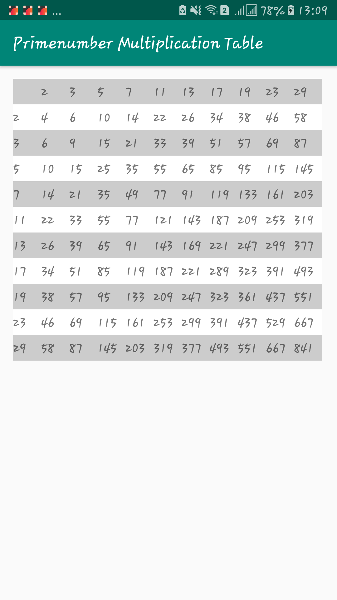

# Dependencies
To run this project you need to have:

- JDK 7 or higher
- Android Studio 3.2 or higher (https://developer.android.com/studio/)
- Kotlin Plugin 1.2.50
# Setup the project

Install the dependencies above
```sh
$ git clone git@github.com:othreecodes/PrimenumberMultiplicationTable.git # Clone the project

$ cd PrimenumberMultiplicationTable

$ ./gradlew test #run tests
```

Open Android Studio
Click "Open an existing Android Studio Project"

Build the project and run the tests to see if everything is working fine

# Output

